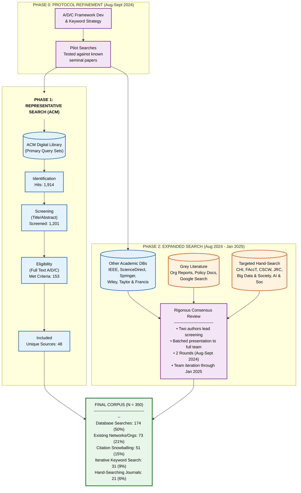
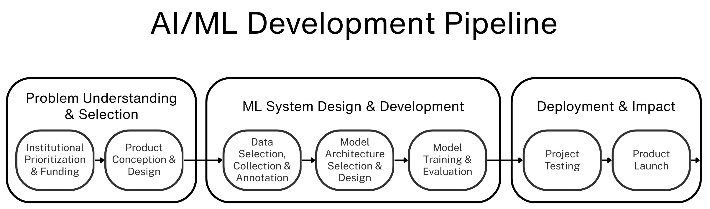

# Understanding AI Data Production & Community Impacts Worldwide: A Multivocal Literature Review

**Companion repository for the ACM RC journal submission:**
*"Understanding AI Data Production & Community Impacts Worldwide: A Multivocal Literature Review"*

Anonymous Author(s)

This repository contains the coded dataset and supplementary visualizations regarding the search and selection protocol used in our Multivocal Literature Review (MLR).

| **Paper** | **Dataset** | **Appendices** |
|---|---|---|
| [**Read Draft (PDF)**](docs/multivocal-ai-data-communities.pdf) | [**MLR Corpus (Excel)**](data/mlr_corpus_350.xlsx) | [**Supplementary Appendices (PDF)**](docs/supplementary-appendices.pdf) |

---

## Search & Selection Process

The following flow diagram details our attrition and selection protocol, integrating representative academic searches (ACM) with grey literature strategies.

> **Note:** This figure supplements the methodology section of the submitted PDF.

---

## Context: The AI Development Pipeline

We position data production not as a mere prerequisite, but as a site of sociotechnical power. The image below illustrates the interwoven domains of AI (A), Data Production (D), and Community Impacts (C).

